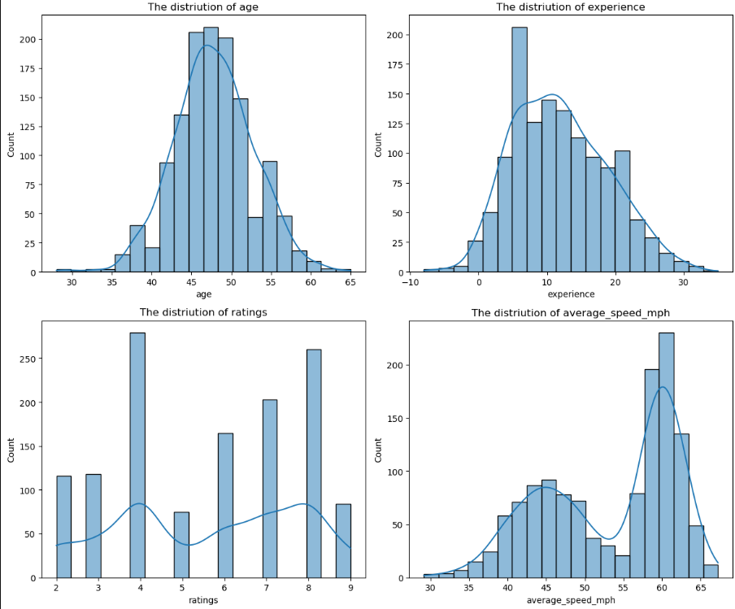
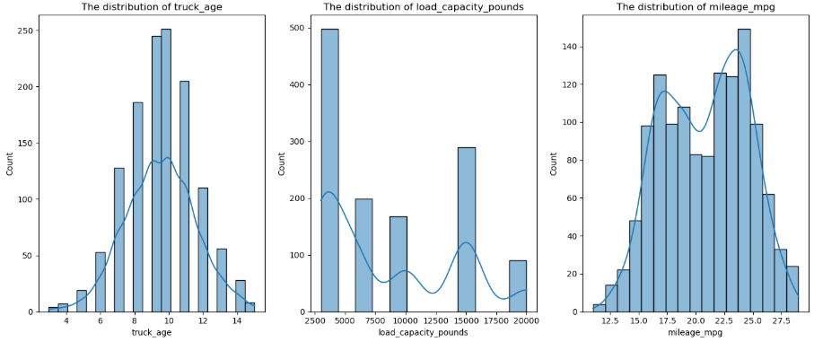
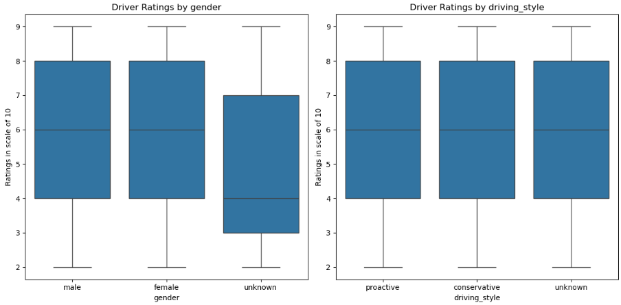

## Business Problem 

## Project Goal

## Project Architecture 

 I.  *Cloud-Native Data Foundation:*

  PostgreSQL and MySQL databases were deployed on AWS RDS to establish a robust and scalable data infrastructure. This setup enables structured data storage, fast SQL-based querying, and seamless integration with other AWS services and downstream analytics workflows. This supports real-time insights on the incoming streaming data.

 II. *Exploratory Data Analysis (EDA):*

  EDA was performed using AWS SageMaker notebooks, connected directly to the RDS-hosted databases. This phase involved thorough data exploration, cleaning, and validation. The refined dataset was then stored in **Hopsworks Feature Store** for centralized access and reuse.

 III. *Feature Engineering :*
  
  Cleaned data was retrieved from Hopsworks to perform preprocessing and feature engineering .Multiple data sources were merged to construct a final feature-rich DataFrame capturing key factors influencing truck delays. The engineered features were saved back to the Feature Store to ensure consistency and accessibility.

 IV. *Model-Ready Dataset Preparation :*

  The final dataset was retrieved from Hopsworks and split into training, validation, and test sets. Further preprocessing included one-hot encoding of categorical variables and scaling of numerical features to prepare the data for machine learning models.

V. *Tier 5: Experiment Tracking with Weights & Biases (W&B):*

  A W&B project was initiated to manage model experimentation and performance tracking. Integration with the Python environment enabled seamless logging of metrics, artifacts, and hyperparameter configurations.

VI.  *Model Development and Selection :*

  Multiple models were built, trained and evaluated, followed by hyperparameter tuning uisng W&B sweeping techniques. The best-performing model was selected based on the highest performance metrics and consistency across data splits.

VII. *Application Deployment :*
   
  A Streamlit application was developed to serve predictions interactively. The final model was deployed on an AWS EC2 instance to ensure scalable and accessible inference.

VIII. *Monitoring and Automation:*

  Model monitoring was implemented to detect data and concept drift. CI/CD practices were integrated for automated deployment, and Amazon SageMaker Pipelines were used to orchestrate the end-to-end machine learning workflow. This ensures reliability, scalability, and operational efficiency in real-world logistics scenarios.

## Data
The original raw datasets are stored in two SQL databases. 
The PostgreSQL database had the store the tables ; `routes_details` and `routes_weather`:  

   -  routes-details: Information about truck routes, including origin, destination, distance, and travel time
   -  routes_weather: Weather conditions specific to each route.

The MySQL database had store the tables: `drivers_details1`,`city_weather`,`truck_detais`,`traffic_details`,`truck_Schedule_data`:
   -  drivers_details: Details about truck drivers, including names and experience
   -  city_weather: Weather data for various cities
   -  truck_details: Information about the trucks used in logistics operations
   -  traffic_details: Traffic-related data
   -  truck_schedule_data: Schedules and timing information for trucks
## Exploratory Data Analysis (EDA) 

The following insights were gained from the EDA. 

The distributions of key numerical variables  `age`, `experience`, `ratings`, and `average_speed_mph` were visually represented to provide insights into driver demographics and performance patterns.

   *Image 1 : Desnity plots for the distribution of numerical variables* 

Driver performance and beahvior according to above plot shows , 
- Age & Experience: Driver age is normally distributed, peaking at 45–50 years. Experience is slightly left-skewed, with most drivers having 5–20 years of experience. Older drivers may be more prone to fatigue and health issues, highlighting the need to match routes with experience levels to avoid delays.
- Efficiency & Training: Analyzing the link between experience and driving efficiency is crucial. Implementing rest policies and offering training on proper techniques can enhance performance.
- Low Ratings: A significant number of drivers have low ratings, which may indicate poor performance or customer dissatisfaction. Further investigation is recommended.
- Driving Styles: The bimodal distribution of average speeds (peaks at 45 and 60 mph) suggests two distinct driving styles—cautious and aggressive. Both extremes may negatively impact ETA, fuel efficiency, and safety. Categorizing drivers by speed behavior can help optimize operations.

The follolwing plot shows hpow the truck age, their load capacity and mileage influence the fleet efficiency. 

   *Image 2: Evaluating Truck Age and Mileage for Fleet Optimization*

The distribution of truck age is approximately normal, with most vehicles between 8 and 12 years old. In contrast, vehicle mileage shows a bimodal distribution, suggesting two distinct groups: one with lower mileage (likely newer trucks) and another with higher mileage (likely older or heavily used trucks).Analyzing the relationship between truck age and fuel efficiency can help identify vehicles nearing the end of their useful life. Replacing older, less efficient trucks with low-mileage, fuel-efficient models could improve overall fleet performance and reduce operational costs.

The following bos plots shows the relationship between the different drivers attributes. 

  *Image 3:Driver Ratings by Gender and Driving Style*

The analysis of driver ratings based on gender and driving style reveals patterns that may help identify performance trends and areas for improvement. Understanding how these factors influence customer satisfaction and driving efficiency can guide targeted training and support initiatives.

## Model Monitoring and Automation 

This section outlines setting up the end to end machine learning pipeline within SageMaker Studio (Unified Experience),by implementing model monitoring, CI/CD practices, and Amazon SageMaker Pipelines for improved reliability and efficiency. It simulates the ingestion of streaming data into the pipeline, performs data drift and model drift detection, triggers automated model retraining and evaluation, and schedules SageMaker Pipeline executions to maintain model freshness and reliability. 

The automated SageMaker pipeline was built using the SageMaker Python SDK. The **get_pipeline** function of the [pipeline.py](Pipeline/Sagemaker_Pipeline/pipeline.py) represents the end-to-end workflow of each step executed within the pipeline. It captures key stages providing a structured and reproducible framework for machine learning operations. The process workflow shows the steps used in the pipeline.

Model retraining is executed on a weekly basis, specifically on the first day of each week. The retraining process is initiated when either data drift or model drift is detected, following the ingestion of incoming streaming data into Hopsworks. To simulate the retraining pipeline with incoming streaming data, historical data from 01/01/2019 to 02/15/2019 was used, while data from 02/15/2019 to 02/28/2019 was treated as streaming data. For the streaming simulation, time-sensitive information was considered: traffic and weather forecast data was ingested into the feature store on a weekly basis, while truck schedule data was ingested daily. This setup ensured that the drift detection pipeline was triggered weekly.

### Model monitoring 

There are several ways to monitor the model in order to determine if the model should be retrained. 
1. Data Quality checks : Ensure data reliability, detect missing values and duplicates or schema inconsistencies in the incoming streaming data.
2. Data Drift detection : Detect change in  statistical properties of feataure distribution of the incoming data when compared with the historical data.
3. Model drift detection : Detect declination of the performance of the model overtime due to chnage of the underlying data or envionmental factors.

 #### Evidendently AI 
In this project, Evidently AI is used to perform model monitoring checks. It is an open-source Python library that compares new incoming data (streaming or batch) against reference data (historical or training data) to detect data drift, target drift, missing values, or changes in feature distributions, and to validate ML model performance. The library comes with built-in tests for each of these activities, automatically analyzing data and model predictions, generating clear metrics and visual reports. This enables teams to quickly identify issues, ensure data consistency, and maintain reliable model performance without writing custom checks.

### Automation for Sagemaker Pipeline Execution 

#### Lambda Function 

AWS lambda service is a serverless compute service that automatically scales and executes the logic in response to events.It's triggered by events like S3 uploads, API Gateway calls, DynamoDB updates, CloudWatch schedules. In this project lambda function is use to ingest and preprocess streaming data, update RDS tables, trigger weekly drift detection logic and automate daily data updates without manual intervention.

The Lambda function handles fetching streaming data from S3, performing SQL inserts and updates, and setting flags to indicate whether the streaming pipeline should be executed. It is automatically triggered by Amazon EventBridge, with a scheduled rule set to invoke the function at a specified time each day, ensuring all necessary tasks for the consistent execution of the streaming data pipeline are completed.

1. Retrive Control parameters:

The 'CONSTANT" table created in the postgre SQL database stores the control paramters needed for the streaming activities. It incldues  count of data records for each streaming dataframes; `routes_weather`, `truck_schedule_data`, `traffic_details`, `city_weather` , boolean column  `is_first_day_of_new_week`  to check the start of the week, `week_start_date` to store the date when the week begins, `day` to track the current day of the week, boolean column weekly streaming `weekly_streaming`  to denote whether weekly streaming is enabled. 
Lambada function creates a connection to the postgreSQL database using psycopg2 to retrieve the data from this table.

2. Downloads daily streaming data from  S3 :

Creates a boto3 client to S3 bucket and downloads the daily streaming files from the S3 bucket.It then downloads the daily streaming files from S3 into the temporary /tmp/ directory of the Lambda container.After downloading, the files are loaded into pandas DataFrames, allowing structured in-memory data manipulation and further processing within the Lambda function.

3. Filters date range from the streaming data :

The start date for the streaming data should be 02/15/2019. So, flag `is_15` is set to check if the start date is 02/15/2019 and different times are used to ensure the streaming data covers only the intended window for that day. If the date is 02/15/2019, only data from 6 AM to 6PM is consideredd as it might have incomplete data in the early hours, so starting at 6 AM ensures consistency.For other days, the system can process from midnight to 6 PM.This ensures your streaming pipeline doesn’t process irrelevant or missing data outside the intended time window.

4. Filters the first day of the week :

As the streaming was done on the first day of the week. A flag`first_day_of_the_week` is set to check if the `weekly_streaming` value of the CONSTANTS table is 1. Then the straming dataframes are updated to include the 7 days of the current week, which starts from the midnight of the first day and ends on the midnight of the 6 th day. After processing, the `weekly_streaming` column in the constants table is incremented by 1, marking progression to the next day in the week. If the counter reaches &, it marks the end  of the week and `weekly_streaming` column is reset to 1, for the new week.For any other day in the week, the counter is incremented by 1 to move to the next day. This upates to the constants table keeps track of the current day of the weekly streaming cycle, allowing the pipeline to know which part of the week it is processing.

5. Setting weekly drift pipeline: 

It sets a flag to determine whether the weekly drift pipeline should be triggered. The trigger depends on two conditions; if the both flags `first_day_of_the_week` and `not_15`  were true.It uUpdates the constants table column `is_first_day_of_new_week` to "True" and  signals downstream processes that it’s time to run the weekly drift pipeline.

6. Updates MySQL and PostgreSQL RDS tables:

Creates a connection to the MySQL  and PostgreSQL databases.Appends weekly streaming data frames to the corresponding tables in the SQL databases if the day is first day of the week. Daily streaming schedule data is updated daily to the MySQL RDS table. The `day` counter in constants is incremented to track progression through the weekly cycle.

7. Update Delay for Previous Day:

The goal is to compare the streaming (latest) schedule values against the persisted RDS truck_schedule_data for the previous day and recompute an updated delay and then write the updated delays back to the database. The logic is run only when the flag `not_15` to True, to ensure only the streaming data which was collected after 02/15/2019 is considered. It updates the delay value of the truck_schedule_data table in the postgreSQL database with the matched records from streaming data, with same route_id, truck_id and departure_date.

#### Sagemaker pipeline in Unified Studio 
In Unified Studio, the SageMaker pipeline is developed within a single notebook that is linked to a Git repository. Each step of the streaming pipeline is implemented as a separate .py file within this notebook environment. These files are then pushed to AWS CodeCommit, which integrates with AWS CodePipeline to provide CI/CD capabilities—ensuring version control, automated testing, and seamless deployment of pipeline updates.

#### Docker Image 

Running a SageMaker pipeline step inside a Docker image provides a custom environment where all required Python packages, dependencies, and system libraries can be pre-installed, eliminating reliance on SageMaker’s default setup. This ensures consistency and reproducibility across runs, which is especially important for production ML pipelines handling continuous streaming data. Using a Docker image also simplifies CI/CD integration, as the image can be built, tested, and pushed to ECR through CodePipeline, allowing SageMaker to pull a fully tested environment for each pipeline execution.

#### SageMaker Pipeline Deployment with AWS CodePipeline for CI/CD

To establish a CI/CD pipeline for a SageMaker pipeline using AWS CodePipeline, the first step is to version the SageMaker pipeline code in an AWS CodeCommit repository. Subsequently, a CodeBuild project is created  in AWS CodeBuild to install the necessary dependencies and execute a deployment script (e.g., pipeline.upsert()) to create or update the SageMaker pipeline.

Following this, a CodePipeline is  created  in AWS CodePipeline configure it with three primary stages: a *source stage* linked to the CodeCommit repository with automatic change detection, a *build stage* that utilizes the CodeBuild project to deploy the pipeline, and an optional deploy stage for any additional actions if required. 

Once the pipeline is configured, any commit to the Codecommit repository automatically triggers CodePipeline and execute or update the pipeline in SageMaker (via pipeline.upsert(), This ensurres that the SageMaker pipeline remains consistently updated with the latest code.

#### Scheduling and execution of the Sagemaker Pipeline 

Once the pipeline is deployed and registered in SageMaker, EventBridge handles when the pipeline runs.AWS EventBridge is used to schedule the SageMaker pipeline using a custom CRON expression, enabling automated and recurring execution of the latest version of the pipeline without manual intervention.
