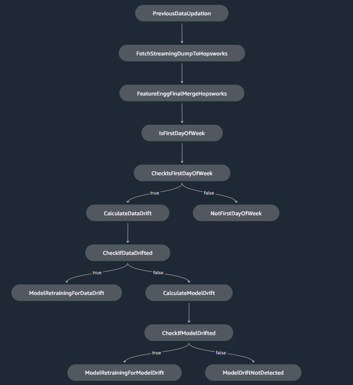

## Business Problem 

## Project Goal

## Project Architecture 

 I.  *Cloud-Native Data Foundation:*

  PostgreSQL and MySQL databases were deployed on AWS RDS to establish a robust and scalable data infrastructure. This setup enables structured data storage, fast SQL-based querying, and seamless integration with other AWS services and downstream analytics workflows. This supports real-time insights on the incoming streaming data.

 II. *Exploratory Data Analysis (EDA):*

  EDA was performed using AWS SageMaker notebooks, connected directly to the RDS-hosted databases. This phase involved thorough data exploration, cleaning, and validation. The refined dataset was then stored in **Hopsworks Feature Store** for centralized access and reuse.

 III. *Feature Engineering :*
  
  Cleaned data was retrieved from Hopsworks to perform preprocessing and feature engineering .Multiple data sources were merged to construct a final feature-rich DataFrame capturing key factors influencing truck delays. The engineered features were saved back to the Feature Store to ensure consistency and accessibility.

 IV. *Model-Ready Dataset Preparation :*

  The final dataset was retrieved from Hopsworks and split into training, validation, and test sets. Further preprocessing included one-hot encoding of categorical variables and scaling of numerical features to prepare the data for machine learning models.

V. *Tier 5: Experiment Tracking with Weights & Biases (W&B):*

  A W&B project was initiated to manage model experimentation and performance tracking. Integration with the Python environment enabled seamless logging of metrics, artifacts, and hyperparameter configurations.

VI.  *Model Development and Selection :*

  Multiple models were built, trained and evaluated, followed by hyperparameter tuning uisng W&B sweeping techniques. The best-performing model was selected based on the highest performance metrics and consistency across data splits.

VII. *Application Deployment :*
   
  A Streamlit application was developed to serve predictions interactively. The final model was deployed on an AWS EC2 instance to ensure scalable and accessible inference.

VIII. *Monitoring and Automation:*

  Model monitoring was implemented to detect data and concept drift. CI/CD practices were integrated for automated deployment, and Amazon SageMaker Pipelines were used to orchestrate the end-to-end machine learning workflow. This ensures reliability, scalability, and operational efficiency in real-world logistics scenarios.

## Data
The original raw datasets are stored in two SQL databases. 
The PostgreSQL database had the store the tables ; `routes_details` and `routes_weather`:  

   -  routes-details: Information about truck routes, including origin, destination, distance, and travel time
   -  routes_weather: Weather conditions specific to each route.

The MySQL database had store the tables: `drivers_details1`,`city_weather`,`truck_detais`,`traffic_details`,`truck_Schedule_data`:
   -  drivers_details: Details about truck drivers, including names and experience
   -  city_weather: Weather data for various cities
   -  truck_details: Information about the trucks used in logistics operations
   -  traffic_details: Traffic-related data
   -  truck_schedule_data: Schedules and timing information for trucks

## Model Monitoring and Automation 

This section outlines setting up the end to end machine learning pipeline within SageMaker Studio (Unified Experience),by implementing model monitoring, CI/CD practices, and Amazon SageMaker Pipelines for improved reliability and efficiency. It simulates the ingestion of streaming data into the pipeline, performs data drift and model drift detection, triggers automated model retraining and evaluation, and schedules SageMaker Pipeline executions to maintain model freshness and reliability. 

The automated SageMaker pipeline was built using the SageMaker Python SDK. The **get_pipeline** function of the [pipeline.py](Pipeline/Sagemaker_Pipeline/pipeline.py) represents the end-to-end workflow of each step executed within the pipeline. It captures key stages providing a structured and reproducible framework for machine learning operations. The process workflow shows the steps used in the pipeline.

